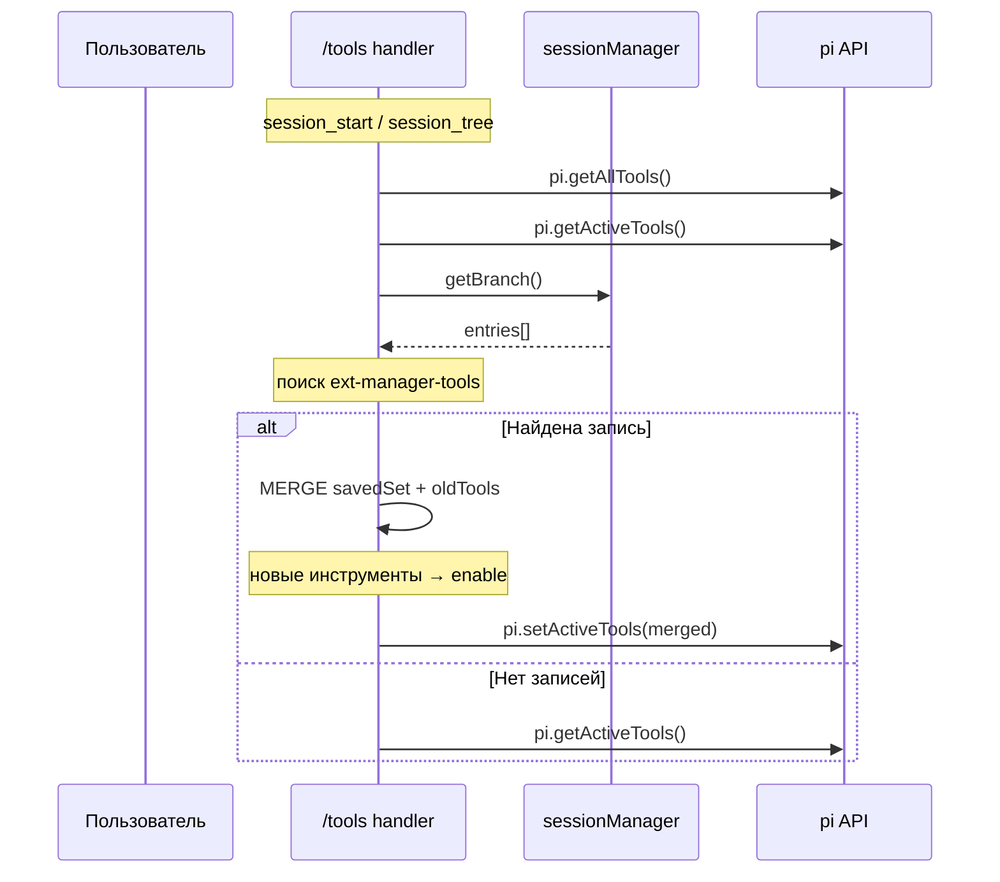
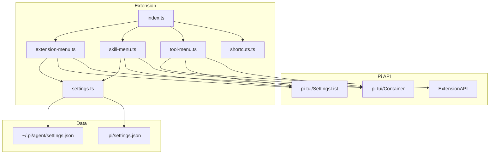

# Архитектура pi-extension-manager

## Обзор

`pi-extension-manager` — это расширение для **pi-coding-agent**, предоставляющее три
интерактивных TUI-меню для управления runtime-компонентами pi:

| Команда | Управляет | Хранилище | Требует `/reload` |
|---------|-----------|-----------|-------------------|
| `/extensions` | Расширения и пакеты (npm/git) | `settings.json` (`extensions`/`packages`) | Да |
| `/skills` | Скиллы (навыки) | `settings.json` (`skills`) | Да |
| `/tools` | Инструменты (read, bash, edit, …) | Сессия pi (`appendEntry`) | Нет |

---

## 1. Структура проекта

```
pi-extension-manager/
├── index.ts              ← точка входа (default function)
├── lib/
│   ├── settings.ts       ← слой данных: чтение/запись settings.json
│   ├── extension-menu.ts ← /extensions
│   ├── skill-menu.ts     ← /skills
│   ├── tool-menu.ts      ← /tools
│   └── shortcuts.ts      ← Ctrl+Shift+E / T / S
├── .gitignore
├── LICENSE
├── README.md
├── README_DEV.md
└── ARCHITECTURE.md
```

**Правило:** все файлы, кроме `index.ts`, лежат в `lib/`. Это обязательно —
pi сканирует `.ts`-файлы в корне расширения. Если положить хелперы рядом
с `index.ts`, pi попытается загрузить их как отдельные расширения.

---

## 2. Поток управления (Control Flow)

### 2.1. Загрузка расширения

```
pi start
  └─ resource-loader сканирует ~/.pi/agent/extensions/
       └─ находит папку pi-extension-manager/
            └─ загружает index.ts
                 └─ default function (pi: ExtensionAPI)
                      ├─ registerExtensionMenu(pi)  → регистрирует команду "extensions"
                      ├─ registerSkillMenu(pi)      → регистрирует команду "skills"
                      ├─ registerToolMenu(pi)       → регистрирует команду "tools"
                      └─ registerShortcuts(pi)      → регистрирует Ctrl+Shift+E/T/S
```

### 2.2. Общий жизненный цикл TUI-команды

```
Пользователь вводит /extensions (или /skills, /tools)
  │
  ├─ 1. Проверка ctx.mode === "tui"
  │     Если нет → notify("требуется TUI") → выход
  │
  ├─ 2. Сбор данных
  │     buildExtPackageList() / buildSkillList() / pi.getAllTools()
  │
  ├─ 3. Построение settingItems[]
  │     Каждый item: { id, label, description, currentValue, values[] }
  │
  ├─ 4. Если команда требует reload:
  │     for item of items: item._localEnabled = item.enabled
  │
  ├─ 5. await ctx.ui.custom((tui, theme, kb, done) => { ... })
  │     │
  │     ├─ 5a. Создание Container
  │     │     └─ Header-компонент (заголовок + счётчик для /tools)
  │     │
  │     ├─ 5b. Создание SettingsList(items, maxVisible, theme, onChange, onCancel)
  │     │
  │     ├─ 5c. Возврат компонента { render, invalidate, handleInput }
  │     │
  │     └─ 5d. Ожидание done() — пользователь закрыл меню (Esc)
  │
  ├─ 6. После закрытия UI
  │     ├─ Подсчёт изменений: _localEnabled !== enabled
  │     ├─ Если есть изменения → save*List(items) + notify
  │     └─ Если нет → notify("No changes")
  │
  └─ Конец
```

### 2.3. Исключение: /tools (runtime, без reload)

`/tools` отличается от двух других команд:

1. Использует **глобальные модульные переменные** `allTools` и `enabledTools`
   — они живут всё время жизни расширения (не пересоздаются при каждом вызове)
2. Состояние хранится **в сессии pi** через `pi.appendEntry()`, а не в `settings.json`
3. Изменения применяются **мгновенно** через `pi.setActiveTools()`
4. На каждый toggle вызывается `pi.setActiveTools()`, но `persistTools()` — только при закрытии меню

```
/tools handler
  │
  ├─ pi.getAllTools()           ← все зарегистрированные инструменты
  ├─ pi.getActiveTools()        ← текущие включённые
  │
  ├─ Открытие TUI
  │   └─ onChange(id, newValue):
  │        ├─ enabledTools.add/delete(id)
  │        ├─ pi.setActiveTools(...)  ← МГНОВЕННОЕ ПРИМЕНЕНИЕ
  │        └─ tui.requestRender()     ← обновление счётчика
  │
  └─ Закрытие TUI
       └─ persistTools()        ← appendEntry в сессию
```

#### 2.3.1. Восстановление состояния сессии



---

## 3. Слой данных (Data Layer)

### 3.1. settings.ts

```mermaid
flowchart LR
    A[buildExtPackageList] --> B[Чтение user settings]
    A --> C[Чтение project settings]
    B --> D[Слияние: project поверх user]
    C --> D
    D --> E[Парсинг префиксов +/-]
    E --> F[ExtPackageItem[]]

    G[buildSkillList] --> B
    G --> C
    G --> H[Слияние: project поверх user]
    H --> I[Парсинг префиксов +/-]
    I --> J[SkillItem[]]

    K[saveExtPackageList] --> L[getActiveSettingsFile]
    L --> M[Чтение файла]
    M --> N[Формирование массивов с -префиксами]
    N --> O[Запись файла]

    P[saveSkillList] --> L
    P --> Q[Формирование массива с -префиксами]
    Q --> O
```

#### 3.1.1. Формат settings.json

```jsonc
{
  "extensions": [
    "npm:pi-subagents",
    "-git:github.com/user/repo"   // "-" = disabled
  ],
  "packages": [
    "npm:pi-websearch"
  ],
  "skills": [
    "/home/user/.pi/skills/my-skill",
    "-/home/user/.pi/skills/old-skill"  // "-" = disabled
  ]
}
```

**Правила префиксов:**
- `-` перед путём → disabled (pi не загружает)
- Без префикса → enabled
- При сохранении `getBase()` удаляет **все** ведущие `-`, потом добавляет один

#### 3.1.2. User vs Project settings

Два источника с приоритетом project:

| Файл | Путь | Приоритет |
|------|------|-----------|
| User | `~/.pi/agent/settings.json` | Низкий |
| Project | `$CWD/.pi/settings.json` | Высокий |

Project entries **перезаписывают** user entries с тем же путём
(удаляют старый индекс, добавляют в конец).

---

## 4. TUI-компоненты

### 4.1. SettingsList (из pi-tui)

Основной строительный блок для всех трёх меню.

```
┌─────────────────────────────────┐
│  Tool Manager                   │  ← Header
│  Active: 5/12 tools             │
│                                 │
│  → read              enabled    │  ← выбранный элемент
│    bash              enabled    │
│    edit              enabled    │
│    write             disabled   │  ← toggled
│    search_web        enabled    │
│                                 │
│  Enter/Space to change · Esc    │  ← hint
└─────────────────────────────────┘
```

**Взаимодействие:**
- `↑/↓` — навигация
- `Space/Enter` — переключение значения (циклически по `values[]`)
- `Esc` — закрытие (вызов `onCancel()` → `done()`)

**Особенность:** `SettingsList.activateItem()` сначала обновляет
`item.currentValue`, потом вызывает `onChange(id, newValue)`.

### 4.2. Container (из pi-tui)

Используется для группировки Header + SettingsList.
Header — анонимный класс с методом `render()`, который выводит
заголовок и (для /tools) актуальный счётчик.

---

## 5. Сравнение трёх команд

| Аспект | `/extensions` | `/skills` | `/tools` |
|--------|---------------|-----------|----------|
| Модель данных | `settings.json` | `settings.json` | Сессия pi |
| Тип изменений | Persistent (файл) | Persistent (файл) | Runtime + сессия |
| Применение | Требует `/reload` | Требует `/reload` | Мгновенно |
| Сохранение | При закрытии, если были изменения | При закрытии, если были изменения | При закрытии (всегда) |
| Инициализация | `buildExtPackageList()` | `buildSkillList()` | `pi.getAllTools()` + `pi.getActiveTools()` |
| Восстановление | Чтение `settings.json` при каждом вызове | Чтение `settings.json` при каждом вызове | `session_start`/`session_tree` + MERGE |
| Локальный стейт | Не хранится (stateless) | Не хранится (stateless) | `allTools[]`, `enabledTools Set` (модульные) |
| Кэширование | Нет | Нет | Да, модульные переменные |

---

## 6. Горячие клавиши

| Комбинация | Команда | Описание |
|------------|---------|----------|
| `Ctrl+Shift+E` | `/extensions` | Менеджер расширений/пакетов |
| `Ctrl+Shift+T` | `/tools` | Менеджер инструментов |
| `Ctrl+Shift+S` | `/skills` | Менеджер скиллов |

Реализованы через `pi.registerShortcut()`. Каждая отправляет followUp-сообщение
с соответствующей командой.

---

## 7. Диаграмма зависимостей



---

## 8. Обработка ошибок

| Ситуация | Реакция |
|----------|---------|
| Нет TUI (`ctx.mode !== "tui"`) | `ctx.ui.notify("требуется TUI", "error")` |
| Нет инструментов/скиллов/etc | `ctx.ui.notify("No ...", "warning")` |
| Пустой settings.json | Возвращается `{}` |
| Файл не существует | Возвращается `{}` |
| JSON parse error | Исключение (пробрасывается в pi) |
| Конфликт имён команд | pi сам обрабатывает через `invocationName` |

---

## 9. Ключевые архитектурные решения

1. **Модульные переменные в /tools** — `allTools` и `enabledTools` живут
   в замыкании `registerToolMenu()`. Это позволяет сохранять состояние
   между открытиями меню в рамках одной сессии.

2. **merge-логика restoreState** — при восстановлении из сессии новые
   инструменты (не существовавшие на момент сохранения) включаются
   по умолчанию, а не теряются.

3. **Сохранение только при закрытии** — `persistTools()` вызывается
   только в `done()`, а не на каждый toggle. Это предотвращает
   замусоривание сессии промежуточными записями.

4. **`_localEnabled`** — временный флаг для отслеживания изменений
   в /extensions и /skills. Позволяет сохранять только если
   пользователь действительно что-то поменял.

5. **`getBase(/^-+/)`** — удаляет ВСЕ ведущие дефисы, предотвращая
   накопление `---` при многократных сохранениях.

---

## Заметки

### /tools — сохранение при закрытии
`persistTools()` вызывается **всегда** при закрытии меню `/tools`.
Это не ошибка и не избыточность — запись в сессию (`appendEntry`) служит
только для восстановления состояния на `session_start` / `session_tree`.
Она не влияет на логику работы, но обеспечивает консистентность при
переключении сессий.
